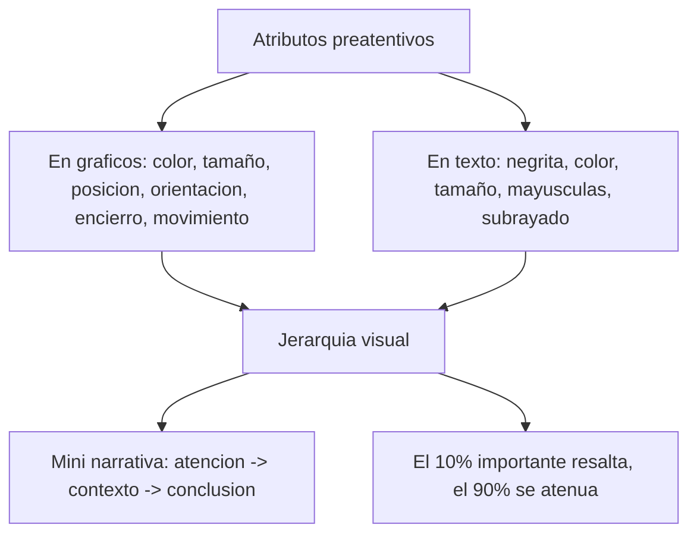

# Atributos preatentivos y jerarquía visual

**TLDR:** Los atributos preatentivos son señales visuales (color, tamaño, posición, orientación, encierro...) que el cerebro procesa "antes de darse cuenta de que está mirando". Bien usados crean jerarquía visual: dictan qué se ve primero, después, y cómo se navega la gráfica.

## Definición

Atributos que resaltan la información importante para verla de inmediato, antes del procesamiento consciente. Indican hacia dónde mirar y **crean jerarquía visual**. Prueba clásica: contar los "3" dispersos en una lista de números tarda ~10 segundos; si los "3" están en otro color, se ven al instante.

Otra prueba práctica: poner la visual en pantalla, cerrar los ojos y abrirlos de golpe para ver a dónde se dirige la mirada primero. Ahí debe estar el insight.

## Lista de atributos preatentivos

En gráficos: **orientación, forma, longitud de línea, grosor/ancho, tamaño, curvatura, marcas especiales, encierro (enclosure), color, intensidad (saturación), posición y movimiento.**

En texto (usarlos con moderación): **cambio de color, tamaño, negritas, itálicas, subrayado/resaltado, mayúsculas, tipo de letra y separación intencional del párrafo.** Los preferidos del profesor: tamaño, color y negritas. (Cita un reporte de **Gartner** que los usaba en texto.)

## Reglas de jerarquía

- **Tamaño relativo = importancia relativa.**
- **Tono / color** atrae la atención; más intenso = más atención (ligado a mapas de calor y coropléticos).
- **Posición:** arriba-izquierda se lee primero (en Occidente).
- Con atributos preatentivos en una sola frase o gráfica se construye una **mini narrativa**: llamado de atención → contexto → mini conclusión (ej. gris para las 10 variables de contexto, color para las 7 relevantes, rojo para las 2 clave).

## Affordance

Los *affordances* del diseño (aspectos que hacen obvio cómo usar algo) en visualización son precisamente estos atributos preatentivos: negrita, cursiva, subrayado, mayúsculas, tipografía, tamaño, color, invertido. Regla del profesor: **como máximo el 10% del diseño es lo importante; el resto son distracciones a eliminar.**

## Preguntas de examen

1. Define "atributo preatentivo" y explica el experimento de contar los "3".
2. Enumera al menos seis atributos preatentivos para gráficos y cuatro para texto.
3. ¿Cómo se relacionan tamaño y color con la jerarquía visual? Da un ejemplo con una paleta de gris + color.
4. ¿Qué es un affordance en diseño visual y por qué el profesor dice que "el 10% del diseño es lo importante"?
5. Describe la prueba de "cerrar y abrir los ojos" y qué valida.

## Fuentes

- `raw/notes/MIACD 6 visualización de datos.txt` (definición, lista de atributos, ejercicio del "3", affordance, jerarquía, prueba de la mirada, reporte de Gartner).
- `raw/articles/Modulo 1 Visualizacion de Datos v2.pdf` (dos tips para mejorar gráficos: remover distracciones y enfocar la atención).

Relacionadas: [[percepcion-visual-y-gestalt]] · [[color-en-visualizacion]] · [[storytelling-con-datos]] · [[tipos-de-graficos]] · [[maestria-miacd]]
