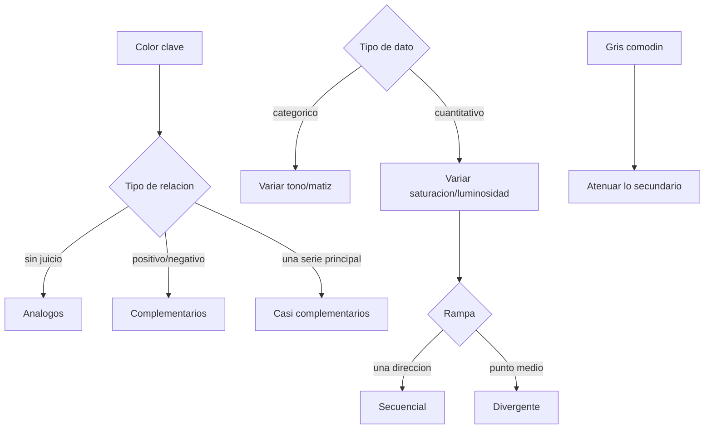

# Color en visualización de datos

**TLDR:** El color es una herramienta estratégica, no decorativa: se define por matiz, saturación y luminosidad, y se elige a partir de un color clave según su posición en la rueda. Regla operativa: variar el **tono** para datos categóricos y la **saturación/luminosidad** para datos cuantitativos; usar el **gris** para atenuar lo secundario.

## Los tres parámetros del color

- **Matiz (Hue):** la tonalidad; rotar sobre la rueda cambia el color (rojo, azul, verde...).
- **Saturación:** la intensidad, de 0 (gris/pálido) a 100 (color puro). En la rueda es el radio: centro pálido, borde saturado.
- **Luminosidad (Lightness):** agregar blanco (más claro) o negro (más oscuro); al máximo, blanco; al mínimo, negro.

La rueda de color se encuentra en PowerPoint ("Más colores") o en herramientas como **Paletón (paletton.com)**.

## Temperatura y semántica

- **Temperatura (percepción):** los colores cálidos saltan hacia el observador (cercanía, calidez); los fríos retroceden (distancia, análisis). Se aprovecha para expresar relaciones y diferencias entre series.
- **Semántica del color** (basada en estudios, no universal): rojo = alerta/peligro/poder; azul = seriedad/confianza; amarillo = optimismo; verde = naturaleza; blanco = paz; negro = elegancia (para contraste). **Varía por cultura** — precaución al diseñar para otras regiones.
- **Color real vs. blanco y negro:** el B/N resalta textura y quita la distracción del color; útil para enfocar en desviaciones o rango en lugar de en las diferencias entre categorías.

## Color clave y paletas

El **color clave** denota las series/puntos de datos más importantes. Se elige como: el color dominante de la marca, uno prominente en las diapositivas, uno de una imagen cercana al gráfico, o uno que evoque la sensación adecuada por asociación cultural.

La paleta se construye según la posición en la rueda respecto al color clave, el número de colores y el tipo de relación entre datos:

- **Análogos** (contiguos): destacar series **sin juicio de valor**.
- **Complementarios** (opuestos): destacar series con connotación **positiva/negativa**.
- **Casi complementarios:** cuando una serie es el interés principal.
- **Complementario dividido:** una serie frente a otras dos relacionadas.
- **Triádicos / complementarios análogos:** una serie principal y sus componentes.
- **Doble complementario (tetrádico):** dos pares de series relacionadas, un par dominante.
- **Rectangular / cuadrada:** cuatro series categóricas de igual énfasis.

## Rampas para valores cuantitativos

- **Secuencial:** de cero a un máximo (cambios de valor en una sola dirección).
- **Divergente:** con un punto medio significativo, positivo/negativo o caliente/frío (ej. control de temperatura).

## Reglas operativas

- **Datos categóricos → variar el tono/matiz.** **Datos continuos/cuantitativos → variar saturación o luminosidad** (se perciben como magnitud).
- **El gris es el comodín:** atenuar lo menos importante en gris y reservar el color para lo relevante (ej. 10 variables en gris → 7 en color → 2 clave en rojo).
- **Usar color con moderación**; desaturar cuando la intensidad molesta (paletas menos saturadas son más agradables).
- **Colores corporativos primero** (alineación con la marca); el negro es aliado para contraste cuando la marca ya usa el color de énfasis.
- Los mismos principios aplican al **texto**: colorizar solo lo esencial y usar negritas (la mirada va primero a lo colorizado, luego a lo negrita).

## Accesibilidad

~**9% de las personas** tiene daltonismo rojo-verde → no usar rojo/verde como única distinción. Cuidar el **amarillo sobre fondo claro** (no se ve, sobre todo en proyector). Recursos: **coblis** (simulador de daltonismo), **colorbrewer2.org** (paletas para cartografía), Paletón (generar paletas).

## Contradicción a señalar

El profesor se traba con la temperatura de luz en grados Kelvin: dice que "5400 K es luz blanca" y que "al disminuir la temperatura, 5400 es luz cálida" (transcripción MIACD 2). Físicamente es al revés: más Kelvin = luz más fría/azul, menos Kelvin = más cálida/amarilla.

## Preguntas de examen

1. Define matiz, saturación y luminosidad, y ubica cada uno en la rueda de color.
2. Regla clave: ¿qué componente del color varías para datos categóricos y cuál para cuantitativos, y por qué?
3. Explica cuándo usar una rampa secuencial vs. una divergente.
4. ¿Qué es el color clave y qué cuatro criterios ayudan a elegirlo?
5. ¿Por qué el gris es "el comodín" y cómo lo usarías en una gráfica de 10 series?
6. ¿Qué precauciones de accesibilidad debes tomar y qué porcentaje de la población tiene daltonismo rojo-verde?

## Fuentes

- `raw/articles/Modulo 1 Visualizacion de Datos v2.pdf` (color real/semántico/sensible, componentes y rueda, temperatura, color clave, paletas para comparar 2/3/4 cosas, rampas secuencial/divergente, recursos: paletton/coblis/colorbrewer).
- `raw/notes/MIACD 2 visualización de datos.txt` (matiz/saturación/luminosidad, temperatura, semántica cultural, daltonismo 9%, categórico→tono / continuo→saturación-luminosidad, gris comodín, Paletón, énfasis en texto).

Relacionadas: [[percepcion-visual-y-gestalt]] · [[atributos-preatentivos-y-jerarquia-visual]] · [[tipos-de-graficos]] · [[visualizacion-de-datos-fundamentos]] · [[maestria-miacd]]
