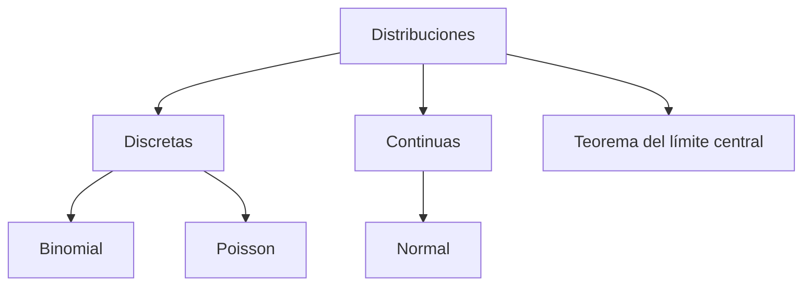

# Distribuciones de probabilidad

**TLDR:** Las distribuciones describen cómo se reparten las probabilidades de una variable aleatoria. Las discretas (binomial, Poisson) cuentan eventos; las continuas (normal) modelan magnitudes. El teorema del límite central explica por qué la normal aparece en todos lados.

## Discretas

- **Binomial:** número de éxitos en n ensayos independientes con probabilidad p.
- **Poisson:** número de eventos en un intervalo (tiempo/espacio) dada una tasa media; útil para conteos raros (p. ej. sismos).

## Continuas

- **Normal (gaussiana):** magnitudes que se agrupan alrededor de una media.
- Otras continuas para tiempos de espera y magnitudes positivas.

## Teorema del límite central (TLC)

La suma/promedio de muchas variables independientes tiende a una distribución normal, sin importar la distribución original. Es la base de gran parte de la inferencia.

## Práctica

Se trabaja en **R** con ejercicios de probabilidad (binomial, Poisson, continuas, sismos, TLC).

## Mapa de conceptos

## Preguntas abiertas

- Relacionar Poisson con el conteo de casos en [[proyecto-dengue]].

## Fuentes

- Curso Estadística — `Ejercicios_Probabilidad/ejercicios_probabilidad.pdf` (Héctor de la Torre Gutiérrez), Google Drive `Maestria/estadistica`.

Relacionadas: [[estadistica-y-probabilidad-fundamentos]], [[proyecto-dengue]]
