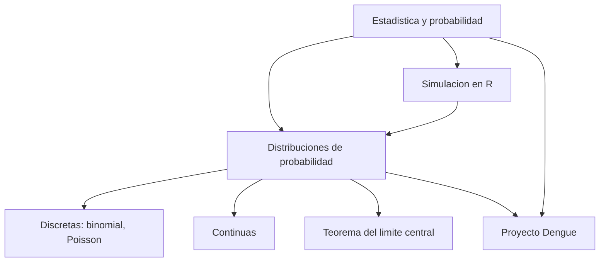

# Estadística y probabilidad: fundamentos (nota hub)

**TLDR:** Nota índice del módulo de Estadística y Probabilidad de la MIACD (Mtro. Héctor de la Torre Gutiérrez). El módulo se apoya fuertemente en **R** para simular experimentos, ajustar distribuciones y validar resultados de forma empírica. Reúne las notas de concepto derivadas de las clases, los ejercicios de probabilidad y el proyecto aplicado de dengue.

## De qué trata el módulo

Construir la base estadística para la ciencia de datos: pasar de describir datos (estadística descriptiva) a **modelar la incertidumbre** (probabilidad) y a **inferir** de una muestra a una población. El enfoque del curso es práctico y computacional: casi todo se comprueba **simulando** en R (p. ej. lanzar millones de dados con `runif`/`set.seed` y analizar la distribución de la suma) en lugar de quedarse solo en la fórmula.

## Mapa de conceptos

Notas derivadas de este módulo:

- [[distribuciones-de-probabilidad]] — variables aleatorias discretas (binomial, Poisson) y continuas; ejemplo de la magnitud de sismos; teorema del límite central.
- [[proyecto-dengue]] — proyecto aplicado en R: análisis de casos de dengue con catálogos y scripts.

## Idea que atraviesa todo

La probabilidad es el lenguaje para cuantificar lo que **no sabemos con certeza**. Una distribución es un modelo que asigna probabilidad a los posibles resultados de una variable aleatoria; elegir la distribución correcta (discreta vs. continua, binomial vs. Poisson) es el primer paso para modelar un fenómeno real. La simulación permite **verificar** ese modelo sin depender solo de la fórmula.

## Preguntas abiertas (para investigar antes del examen)

- **R vs. Python:** este módulo está en R, mientras que [[python-para-ciencia-de-datos-fundamentos]] y [[visualizacion-de-datos-fundamentos]] están en Python. Conviene tener claro el equivalente de cada operación en ambos lenguajes.
- **Inferencia:** las transcripciones cubren distribuciones y TLC; falta confirmar qué tanto entra de pruebas de hipótesis, intervalos de confianza y regresión.
- **Detalle de código:** la sintaxis exacta vive en los cuadernos y scripts fuente (ver Fuentes); esta nota resume conceptos, no reemplaza practicarlos.

## Fuentes

Material en Drive (`Maestria/estadistica/` y lecturas):

- `estadistica/Ejercicios_Probabilidad/ejercicios_probabilidad.pdf` y `.Rmd` — Mtro. Héctor de la Torre Gutiérrez (mod. 30-05-2026): distribuciones discretas/continuas, sismos, teorema del límite central, todo con simulaciones en R.
- `estadistica/Clases_y_Notebooks/` — notebooks de clase, "Statistics for Data Scientists.pdf" e "Introduction to Data Science — Data Analysis and Prediction Algorithms with R.pdf".
- `estadistica/Proyecto_Dengue/` — ver [[proyecto-dengue]].
- `estadistica/ExamenParcial/` — parciales y examen final (repaso).

Relacionadas: [[maestria-miacd]] · [[distribuciones-de-probabilidad]] · [[proyecto-dengue]]