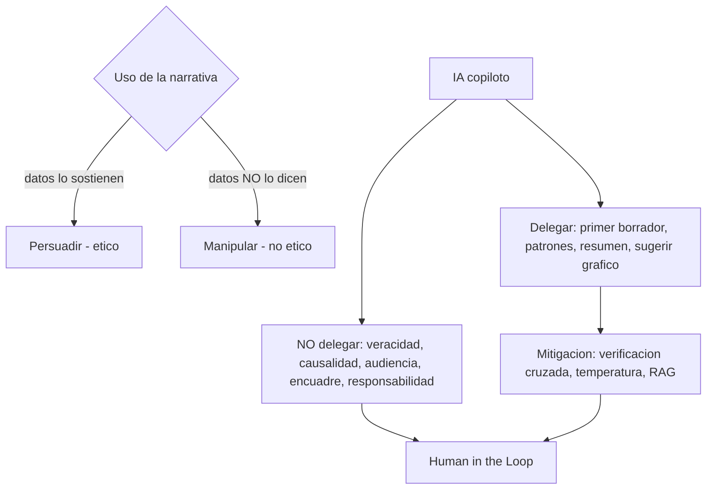

# Ética e IA en la visualización de datos

**TLDR:** Las técnicas de visualización dan el poder de enfatizar u ocultar información, lo que cruza la línea entre persuadir (llevar a una conclusión que los datos sostienen) y manipular (hacer creer algo que no dicen). La IA acelera la narrativa pero no puede delegársele la veracidad, la causalidad, el conocimiento de la audiencia ni la responsabilidad.

## Persuadir vs. manipular

- **Persuadir:** guiar a la audiencia hacia una conclusión **que los datos sí sostienen**.
- **Manipular:** usar la narrativa para que crean algo que los datos **no** dicen. La línea es delgada.

El profesor lo enmarca como *"no es ocultar, es disminuir importancia"*, pero todo debe ser **consciente e intencional**. Errores a evitar: encuadres tendenciosos (un título que insinúa una causa no probada), emociones sin sustento (imágenes que conmueven mientras los datos dicen otra cosa), manipular la **escala** para atenuar un outlier, o usar letra chiquita para ocultar un dato. Si la audiencia carece de pensamiento crítico, se le puede llevar a donde uno quiera — de ahí la responsabilidad ética.

Manejar la emoción con **balance**: humanizar los datos (una cifra de desaparecidos son personas, no números), contextualizar los números (45 mil/mes no impacta hasta multiplicarlo por un sexenio) y crear contrastes, sin caer en la manipulación.

## IA como copiloto: qué sí y qué no

La IA **acelera**: arma la primera narrativa, encuentra patrones, resume, sugiere gráficos. Principio: **"la IA propone, el humano decide"** (Human in the Loop). El cuello de botella ya no es producir el insight sino comunicarlo con criterio.

**Lo que NO se puede delegar a la IA:**

1. **Veracidad de los datos** — los generativos "por diseño alucinan" (fenómeno estadístico); inventan datos, libros y autores. Siempre validar ligas y citas.
2. **Causalidad vs. correlación** — la IA afirma causa donde solo hay correlación (ver correlaciones espurias en [[visualizacion-de-big-data]]).
3. **Conocimiento de la audiencia y el tono** — contexto que solo el humano aporta vía ingeniería de prompts.
4. **Encuadre / no ocultar lo desfavorable** — los generativos tienden a ser complacientes (te dan la razón) → riesgo de manipulación.
5. **Responsabilidad** — nunca automatizable.

### Sesgos
Sesgo algorítmico y de datos: si hay sesgo en los datos de entrenamiento, se amplifica. Sesgo geopolítico/ideológico (ej. modelos que niegan hechos históricos). La mayoría de los datos de entrenamiento están en inglés/chino y cargan ideologías dominantes.

### Técnicas de mitigación
- **Verificación cruzada:** pasar un documento generado por un modelo a otro modelo para detectar errores.
- **Hiperparámetro temperatura** (0 a 1): 0 = factual/directo, 1 = creativo. Bajarla para respuestas menos "inventadas".
- **RAG** (generación aumentada por recuperación) y pre-prompting para evitar la complacencia.
- Human in the Loop: en decisiones de alto impacto el humano autoriza con un clic; en las de bajo impacto el agente puede actuar solo.

## Cómo generan imágenes los generativos

Arquitectura generador + evaluador (concepto GAN/difusión): parte de **ruido** e itera ("¿se parece a un gatito?") optimizando hasta converger. Los sesgos amplificados producen artefactos (siete dedos, un cigarro añadido). La cadena de pensamiento se degrada tras varias iteraciones.

## Marco de responsabilidad y seguridad de datos

Rol de **Security Officer / CISO**; normas **ISO 27000** e **ISO 42000**; regulación sectorial (NOM-004 de expediente clínico en salud, Ley de Protección de Datos Personales, Sarbanes-Oxley tras Enron). Datos biométricos y su regulación. La responsabilidad ante errores de IA (especialmente en salud) es compartida — el humano primero. Principio de la encíclica papal sobre IA citada en clase: *"el algoritmo al servicio de la persona, no la persona al servicio del algoritmo."*

## Preguntas de examen

1. Distingue persuadir de manipular con un ejemplo de cada uno.
2. ¿Cuáles son los cinco elementos que NO se pueden delegar a la IA en la narrativa de datos?
3. ¿Qué es una alucinación de un modelo generativo y cómo se mitiga?
4. Explica el hiperparámetro temperatura y para qué lo ajustarías al generar una narrativa.
5. ¿Qué significa "Human in the Loop" y cómo se decide cuándo el humano debe autorizar?
6. Da dos ejemplos de manipulación por diseño visual (escala, tamaño de texto) y cómo evitarlos.

## Fuentes

- `raw/notes/MIACD 6 visualización de datos.txt` (persuadir vs. manipular, límites de la IA, encuadre, contextualizar números, responsabilidad).
- `raw/notes/MIACD 5 visualización de datos.txt` (IA propone/humano decide, veracidad, sesgos, verificación cruzada, temperatura, complacencia).
- `raw/notes/MIACD 3 visualización de datos.txt` (Human in the Loop, alucinaciones, RAG, generador+evaluador, sesgo algorítmico, vibe coding).
- `raw/notes/MIACD 4 visualización de datos.txt` (seguridad de datos, CISO, ISO 27000/42000, regulación, responsabilidad compartida en salud).
- `raw/articles/Modulo 1 Visualizacion de Datos v2.pdf` (buenas prácticas para evitar distorsión de datos; ética y responsabilidad en la presentación de datos como módulo 4).

Relacionadas: [[storytelling-con-datos]] · [[herramientas-de-visualizacion]] · [[visualizacion-de-big-data]] · [[visualizacion-de-datos-fundamentos]] · [[maestria-miacd]]
