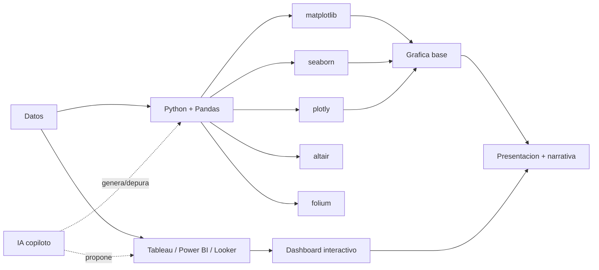

# Herramientas de visualización de datos

**TLDR:** El stack va de librerías de Python (matplotlib, seaborn, plotly, altair, folium) a herramientas no-code de BI (Tableau, Power BI, Looker Studio). Regla práctica: Python para el trabajo de datos y la gráfica base; el reporteador/presentación para el "toque" narrativo. En 2026 la IA es copiloto (genera y depura código, propone gráficos) pero el humano decide.

## Entorno base: Python + Pandas

Flujo típico: datos (CSV, JSON, ERP, CRM, conectores a BD) → **Pandas DataFrame** (limpiar, filtrar, `groupby`, `resample`) → librería de visualización → gráfica. Ejecutable en **Google Colab**.

### Librerías de Python

- **matplotlib:** la biblioteca base; flexibilidad y personalización completa, amplia gama de gráficos, integración con NumPy/Pandas/Seaborn. Curva de aprendizaje amplia. Gráficos estáticos, animados e interactivos. Ej.: `plt.bar(meses, ventas)` con color, título y etiquetas.
- **seaborn:** construida sobre matplotlib; visualizaciones estadísticas avanzadas (mapas de calor, correlación, regresión, distribución), automatiza la estética, se integra con Pandas. Ideal para EDA.
- **plotly (Plotly Express):** gráficos **interactivos**; de estático a interactivo, subconjuntos dinámicos, series temporales interactivas, mapas coropléticos, y **WebGL** para muchísimos puntos.
- **altair:** visualización **declarativa** que implementa una **gramática de gráficos** (grammar of graphics): se declara qué variable va a qué canal, con su tipo y color, y el motor resuelve; genera vistas enlazadas.
- **folium:** mapas web reales (calles, marcadores, heatmaps geográficos) desde Python; produce un HTML abrible en el navegador.
- **datashader:** dibuja cientos de miles/millones de puntos sin saturar el render (ver [[visualizacion-de-big-data]]).

> Nota: en las **clases grabadas** el profesor solo menciona "Python" y "librerías gráficas" de forma genérica; matplotlib, seaborn, plotly, altair y folium aparecen nombradas en el **PDF del Módulo 1-2** y en las sesiones MIACD 3-4. El código concreto vive en los notebooks del Blackboard, no en las transcripciones.

## Herramientas no-code / BI

- **Tableau:** interfaz drag-and-drop intuitiva, visualizaciones interactivas, dashboards y reportes, integración con múltiples fuentes; casi sin código. Licenciamiento empresarial para publicar.
- **Power BI (Microsoft):** BI y dashboards en tiempo real, análisis avanzado, integración con Excel/Azure/SQL Server/SharePoint; lenguaje **DAX**; muy extendido en México/LatAm; ya incorpora copiloto para generar dashboards con prompts.
- **Looker Studio** (antes Google Data Studio): gratuito, informes interactivos, integración nativa con productos Google (Analytics, Sheets, BigQuery); funciones básicas frente a Power BI/Tableau.

## Código vs. no-code: ¿cuándo cada uno?

No es excluyente. En la vida real es una **combinación**: Python para el trabajo de datos + reporteador (Power BI/Tableau) + toque artesanal en la presentación. Las librerías generan la gráfica "bonita" pero no la visual completa; la teoría visual (etiquetas, resaltados, narrativa) se agrega en la herramienta de presentación o con IA. El **vibe coding** (codificar por lenguaje natural) es una nueva capa de abstracción: se le pide a la IA "genera un gráfico de barras de ventas por mes con matplotlib en color vino con título y etiqueta".

## IA como copiloto de visualización

La IA acelera: genera y depura código, propone gráficos, texto-a-gráfico y BI generativa. Pero **"la IA propone, el humano decide"** — puede mostrar sin explicar, alucina datos y confunde correlación con causa. Ver [[etica-e-ia-en-visualizacion]] para los límites.

## Preguntas de examen

1. ¿En qué se diferencian matplotlib, seaborn y plotly, y cuándo elegirías cada una?
2. ¿Qué significa que altair sea "declarativa" y qué es la gramática de gráficos?
3. ¿Para qué sirve folium y en qué se distingue de un mapa en plotly?
4. Compara Tableau, Power BI y Looker Studio: fortalezas y a quién sirve cada una.
5. Explica por qué "no todo sale del código" y qué agrega la herramienta de presentación.
6. ¿Qué puede y qué no puede delegarse a la IA en el flujo de visualización?

## Fuentes

- `raw/articles/Modulo 1 Visualizacion de Datos v2.pdf` (Python+Pandas, matplotlib, seaborn, Tableau, Power BI, Looker Studio, Plotly Express, código vs. no-code, IA como copiloto).
- `raw/articles/Modulo 2 Visualizacion de Datos v2.pdf` (plotly, altair, folium, datashader/WebGL, mapas coropléticos).
- `raw/notes/MIACD 3 visualización de datos.txt` (matplotlib, seaborn, Tableau, Power BI/DAX, Looker Studio, vibe coding).
- `raw/notes/MIACD 4 visualización de datos.txt` (plotly, altair/grammar of graphics, folium, datashader, hexbin).

Relacionadas: [[visualizacion-de-big-data]] · [[tipos-de-graficos]] · [[etica-e-ia-en-visualizacion]] · [[visualizacion-de-datos-fundamentos]] · [[maestria-miacd]]
