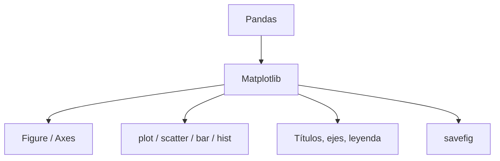

# Matplotlib esencial

**TLDR:** Matplotlib es la librería base de Python para crear gráficos. Con `pyplot` se construyen líneas, barras, dispersión, histogramas y más, controlando ejes, títulos y estilos. Es la herramienta con la que se visualizan los datos ya preparados con Pandas.

## Estructura básica

- Se importa: `import matplotlib.pyplot as plt`.
- Modelo Figure/Axes: `fig, ax = plt.subplots()` — la figura es el lienzo, los ejes (`ax`) donde se dibuja.
- Se muestra con `plt.show()` o se guarda con `plt.savefig()`.

## Gráficos comunes

- **Línea:** `ax.plot(x, y)` — tendencias en el tiempo.
- **Dispersión:** `ax.scatter(x, y)` — relación entre dos variables.
- **Barras:** `ax.bar(cat, valores)` — comparar categorías.
- **Histograma:** `ax.hist(datos)` — distribución de una variable.

## Personalización

- Títulos y etiquetas: `ax.set_title()`, `ax.set_xlabel()`, `ax.set_ylabel()`.
- Leyenda: `ax.legend()`.
- Colores, estilos de línea y marcadores como argumentos.

## Por qué importa

Matplotlib cierra el flujo: datos limpios con [[pandas-esencial]] → gráfico. Conecta con los principios de [[visualizacion-de-datos-fundamentos]] (qué gráfico elegir y cómo comunicar bien).

## Mapa de conceptos

## Preguntas abiertas

- Aplicar el Ejercicio_5 sobre un dataset de la carpeta `data/`.
- Comparar con Seaborn más adelante para gráficos estadísticos rápidos.

## Fuentes

- Curso Ciencia de Datos — Matplotlib: `Clase_Matplotlib_1262`, `Ejercicio_5` (Google Drive `Maestria/Ciencia_de_Datos/Matplotlib`).

Relacionadas: [[python-para-ciencia-de-datos-fundamentos]], [[pandas-esencial]], [[visualizacion-de-datos-fundamentos]]
