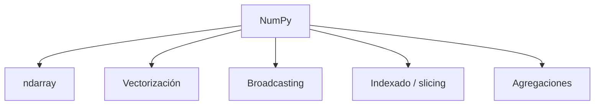

# NumPy esencial

**TLDR:** NumPy es la librería base de cálculo numérico en Python. Su objeto central es el `ndarray` (array N-dimensional), que permite operaciones vectorizadas rápidas sobre grandes volúmenes de números. Es el cimiento sobre el que se construyen Pandas, scikit-learn y casi todo el stack de datos.

## Ideas clave

- **ndarray:** array homogéneo (mismo tipo) de N dimensiones; mucho más eficiente que las listas de Python.
- **Vectorización:** operar sobre arrays completos sin bucles (`a + b`, `a * 2`), rápido y legible.
- **Broadcasting:** operar entre arrays de distinta forma siguiendo reglas de compatibilidad.
- **Indexado y slicing:** seleccionar subconjuntos por posición, rangos o máscaras booleanas.

## Operaciones frecuentes

- Crear: `np.array`, `np.zeros`, `np.arange`, `np.linspace`.
- Forma: `reshape`, `.shape`, `axis`.
- Agregación: `sum`, `mean`, `std`, `min/max` (por eje).
- Álgebra: producto punto, matrices.

## Mapa de conceptos

## Preguntas abiertas

- Practicar con los cuadernos del curso (Cuaderno_5/6/7).

## Fuentes

- Curso Ciencia de Datos — NumPy: `Cuaderno_5`, `Cuaderno_6`, `Cuaderno_7` (Google Drive `Maestria/Ciencia_de_Datos/NumPy`).

Relacionadas: [[python-para-ciencia-de-datos-fundamentos]], [[pandas-esencial]]
