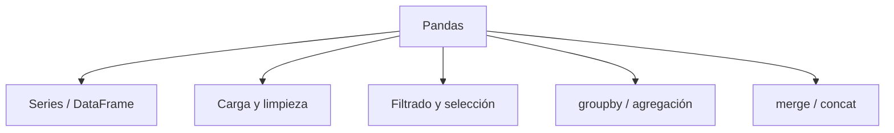

# Pandas esencial

**TLDR:** Pandas es la librería de Python para manipular datos tabulares mediante `Series` (1D) y `DataFrame` (2D). Es la herramienta central para cargar, limpiar, filtrar, agrupar y transformar datos antes de analizarlos o visualizarlos.

## Estructuras básicas

- `Series`: columna con índice.
- `DataFrame`: tabla de filas y columnas; el objeto que más se usa.
- Se construye desde diccionarios, listas, o al leer archivos (`pd.read_csv`, `pd.read_excel`).

## Operaciones frecuentes

- **Carga:** `pd.read_csv("archivo.csv")`.
- **Inspección:** `.head()`, `.info()`, `.describe()`, `.shape`, `.columns`.
- **Selección:** `df["col"]`, `df.loc[filas, cols]` (por etiqueta), `df.iloc[...]` (por posición).
- **Filtrado:** `df[df["edad"] > 30]` (máscaras booleanas).
- **Limpieza:** `.isna()`, `.dropna()`, `.fillna()`, `.astype()`, `.rename()`.
- **Agrupación:** `df.groupby("categoria")["valor"].mean()` — patrón split-apply-combine.
- **Combinar:** `pd.merge()`, `pd.concat()`.

## Por qué importa

Pandas es el paso previo casi obligatorio antes de graficar con [[matplotlib-esencial]] o modelar. Se apoya en arrays de [[numpy-esencial]] por debajo.

## Mapa de conceptos

## Preguntas abiertas

- Practicar los ejercicios del curso (Ejercicio_3, Ejercicio_4) con datasets reales de la carpeta `data/`.

## Fuentes

- Curso Ciencia de Datos — Pandas: `Cuaderno_8`, `Ejercicio_3`, `Ejercicio_4` (Google Drive `Maestria/Ciencia_de_Datos/Pandas`).

Relacionadas: [[python-para-ciencia-de-datos-fundamentos]], [[numpy-esencial]], [[matplotlib-esencial]]
