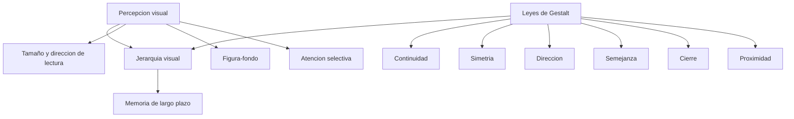

# Percepción visual y leyes de Gestalt

**TLDR:** La visualización funciona porque el cerebro interpreta estímulos visuales antes de razonar sobre ellos. Las leyes de Gestalt (figura-fondo, proximidad, cierre, semejanza, dirección, simetría, continuidad) son las "herramientas" para organizar esa percepción y construir jerarquía visual.

## Percepción: no vemos con los ojos, vemos con la mente

La percepción visual explora cómo el cerebro transforma estímulos visuales en conocimiento comprensible. Los ojos son un sensor; la mente interpreta según cultura, experiencia y sensibilidad (por eso una misma imagen —joven/anciana de *Hábitos Atómicos*, gato/murciélago— se lee distinto). Todo lo que se pone en un gráfico se interpreta, así que debe presentarse de forma intuitiva, clara y significativa.

Mecanismos de percepción relevantes para diseñar:

- **Atención selectiva:** capacidad de enfocarse en estímulos relevantes e ignorar el resto. Atenuar/difuminar el fondo quita atención; lo nítido y contrastado la atrae.
- **Figura y fondo:** todo objeto existe sobre un fondo. Toda superficie rodeada tiende a volverse figura; la figura tiene "calidad de cosa", el fondo de "sustancia". El fondo pasa por detrás y la figura se percibe más cercana, con color más denso, y se recuerda mejor. Por costumbre de la página impresa tendemos a ver el blanco como fondo. (Ej. el logo de Camel donde los edificios forman el camello.)
- **Tamaño / magnitud aparente:** poner algo grande resalta, chico oculta (letra chiquita = ocultar). La magnitud se percibe en relación con el contexto y objetos conocidos.
- **Dirección de lectura:** en Occidente se lee de izquierda a derecha y de arriba abajo, así que sin otra señal la vista empieza arriba-izquierda → ahí va el contexto. En culturas de lectura derecha-a-izquierda cambia; precaución al diseñar para otras culturas.
- **Reglas de fotografía aplicables:** regla de los tercios y puntos dorados (las intersecciones de los tercios son los puntos de mayor peso visual). El profesor Salgado fue fotógrafo profesional y fusiona el lado artístico con el analítico.
- **Valencia:** los rasgos de forma comunican; líneas rectas y puntas = agresivo/rígido; líneas y tipografías redondeadas = flexible/amable.

## Leyes de Gestalt (procesamiento gestáltico)

Se usan como herramientas: no son buenas ni malas, se aplican según el objetivo.

- **Proximidad:** elementos cercanos se perciben como una unidad relacionada → acercar conceptos similares.
- **Cierre:** percibimos formas incompletas como completas (triángulo de Kanizsa, jaula incompleta).
- **Semejanza / igualdad:** elementos con mismo color, forma o estilo se agrupan y se asume que tienen la misma función (ej. botones iguales en UX).
- **Dirección / destino común:** líneas y elementos direccionales guían la mirada; flechas sutiles llevan al espectador de un punto a otro y ordenan la narrativa (contexto → KPIs → insight).
- **Simetría:** las formas simétricas se perciben más agradables y equilibradas; la armonía hace el mensaje más claro y el desorden visual es una barrera.
- **Continuidad:** la mente sigue un patrón o dirección continua (el color puede guiar el recorrido de la mirada).

Aplicación: guiar la atención hacia lo importante, crear **jerarquía visual**, facilitar la navegación y transmitir mensajes claros. Es cuestión de práctica.

## Memoria (por qué un mensaje se queda)

- **Memoria icónica:** dura fracciones de segundo (datos sin importancia).
- **Memoria de corto plazo:** conserva ~4 fragmentos a la vez → no saturar.
- **Memoria de largo plazo:** el mensaje se queda cuando toca fibras sensibles / genera emoción (ej. el crítico de *Ratatouille* recordando la comida de su madre). Objetivo del storytelling: llevar la idea a la memoria de largo plazo.

Nemotecnia del profesor "Bing Bang Bongo" para pasar de corto a largo plazo: (1) qué vamos a contar / gran idea, (2) contenido principal, (3) resumen y conclusiones. La repetición fija (por eso todos conocen Caperucita Roja).

## Contradicción a señalar

El profesor mezcla la terminología de memoria: en algún momento dice que lo relevante "se almacena en la memoria de corto plazo" cuando por contexto se refiere a la de largo plazo (transcripción MIACD 6). El objetivo declarado siempre es la memoria de largo plazo.

## Preguntas de examen

1. Explica la diferencia entre figura y fondo y cómo la usarías para dirigir la atención.
2. Enumera al menos cinco leyes de Gestalt y da un ejemplo de aplicación de cada una en un dashboard.
3. ¿Por qué el contexto suele ir en la esquina superior izquierda? ¿Qué pasa con audiencias de otras culturas?
4. Describe los tres tipos de memoria y explica a cuál debe apuntar una buena visualización y por qué.
5. ¿Qué significa "no vemos con los ojos, vemos con la mente" para el diseño de gráficos?

## Fuentes

- `raw/articles/Modulo 1 Visualizacion de Datos v2.pdf` (teoría de la percepción visual, atención selectiva, figura-fondo, tamaño aparente, valencia, leyes del Gestalt, aplicación).
- `raw/notes/MIACD 1 visualización de datos.txt` (percepción, regla de tercios/puntos dorados, valencia, Gestalt detallado con ejemplos).
- `raw/notes/MIACD 6 visualización de datos.txt` (memoria icónica/corto/largo plazo, "Bing Bang Bongo", repetición).

Relacionadas: [[atributos-preatentivos-y-jerarquia-visual]] · [[color-en-visualizacion]] · [[storytelling-con-datos]] · [[visualizacion-de-datos-fundamentos]] · [[maestria-miacd]]
