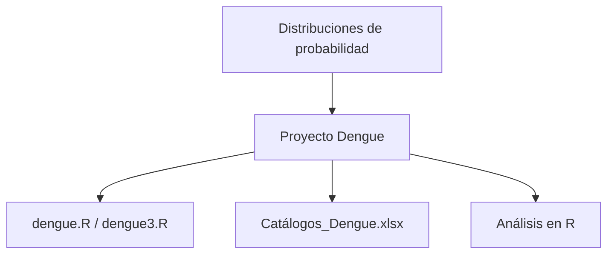

# Proyecto Dengue

**TLDR:** Proyecto aplicado de la Maestría que analiza datos de dengue en R. Combina lo aprendido en estadística/probabilidad con manejo de datos reales (scripts `dengue.R` y catálogos en Excel). Es el caso práctico donde se aterrizan las distribuciones y el análisis exploratorio.

## Qué contiene

- **Scripts R:** `dengue.R`, `dengue3.R` — carga, limpieza y análisis de los datos.
- **Catálogos:** `Catálogos_Dengue.xlsx` — tablas de referencia (códigos, categorías) para interpretar el dataset.

## Enfoque

Análisis de datos epidemiológicos de dengue en R: exploración, resúmenes estadísticos y probablemente modelado de conteos/casos. Se apoya en [[distribuciones-de-probabilidad]] (p. ej. Poisson para conteos) y en [[estadistica-y-probabilidad-fundamentos]].

## Por qué importa

Es el puente entre teoría y práctica: aplica estadística sobre un problema real de salud pública. Buen candidato para el portafolio.

## Mapa de conceptos

## Preguntas abiertas

- Documentar los hallazgos concretos del análisis.
- ¿Rehacerlo en Python (Pandas) como ejercicio comparativo?

## Fuentes

- Curso Estadística — Proyecto_Dengue: `dengue.R`, `dengue3.R`, `Catálogos_Dengue.xlsx` (Google Drive `Maestria/estadistica/Proyecto_Dengue`).

Relacionadas: [[estadistica-y-probabilidad-fundamentos]], [[distribuciones-de-probabilidad]]
