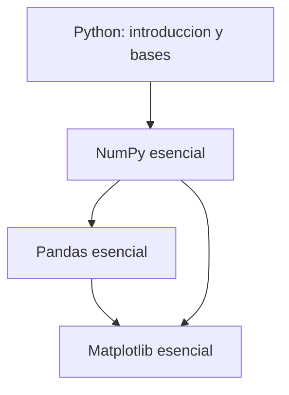

# Python para ciencia de datos: fundamentos (nota hub)

**TLDR:** Nota índice del módulo de herramientas de Python de la MIACD (carpeta `Maestria/Ciencia_de_Datos/`). Cubre el stack base del científico de datos en Python: **Python general → NumPy → Pandas → Matplotlib**, en ese orden de dependencia. Cada herramienta tiene su nota de concepto con los cuadernos de clase como fuente.

## Por qué este stack

Es la "cadena de montaje" del análisis de datos en Python: **NumPy** da el arreglo numérico rápido sobre el que todo se construye; **Pandas** pone encima una capa tabular (filas/columnas con etiquetas) para manipular datos reales; **Matplotlib** los grafica. Dominar los tres cubre el 80% del trabajo diario antes de entrar a modelos.

## Mapa de conceptos

- [[numpy-esencial]] — arreglos n-dimensionales, vectorización y operaciones numéricas rápidas.
- [[pandas-esencial]] — Series y DataFrames: cargar, limpiar, filtrar y agregar datos tabulares.
- [[matplotlib-esencial]] — la librería base para graficar en Python (figure/axes).

Conexión con otros módulos: [[matplotlib-esencial]] es la base técnica de todo lo de [[visualizacion-de-datos-fundamentos]]; y estas herramientas son el equivalente en Python de lo que [[estadistica-y-probabilidad-fundamentos]] hace en R.

## Orden recomendado de estudio

1. **Introducción a Python** — tipos, variables, control de flujo, funciones (base para todo).
2. **NumPy** — el arreglo y la vectorización.
3. **Pandas** — datos tabulares reales.
4. **Matplotlib** — visualización de esos datos.

## Preguntas abiertas

- El detalle de sintaxis y los ejercicios resueltos viven en los cuadernos fuente (ver cada nota); esta capa resume conceptos.
- Falta confirmar si el examen (`Ciencia_de_Datos/Examen/`) pesa más en NumPy o en Pandas.

## Fuentes

Material en Drive (`Maestria/Ciencia_de_Datos/`):

- `Introducción_a_Python/1_Introducción y bases.pdf`
- `NumPy/Cuaderno_5_Numpy.ipynb`, `Cuaderno_6_Numpy.ipynb`, `Cuaderno_7.ipynb`
- `Pandas/Cuaderno_8.ipynb`, `Ejercicio_3-pandas_1 (respuestas).ipynb`, `Ejercicio_4-pandas_2 (respuestas).ipynb`
- `Matplotlib/Clase_Matplotlib_1262.ipynb`, `Ejercicio_5-matplotlib (respuestas).ipynb`
- `Examen/Examen_HECD_1258.ipynb`, `Examen HECD 1262.zip`

Datasets de práctica: `Maestria/data/` (titanic, diamonds, taxi, aircrashes, etc.).

Relacionadas: [[maestria-miacd]] · [[numpy-esencial]] · [[pandas-esencial]] · [[matplotlib-esencial]]