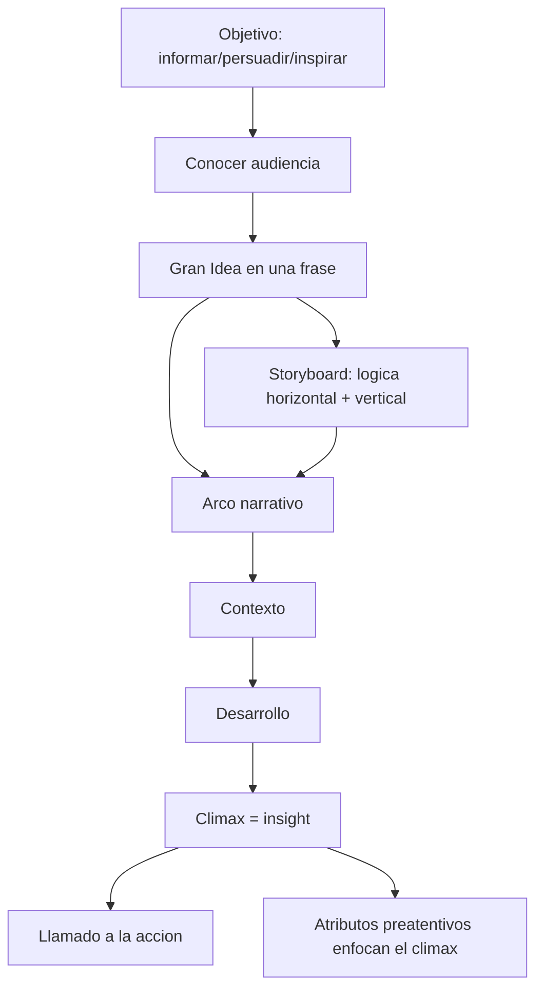

# Storytelling con datos

**TLDR:** El storytelling con datos convierte un insight en una historia clara, persuasiva y accionable. Se construye definiendo objetivo + audiencia, destilando una "gran idea" en una frase, y estructurando un arco narrativo (contexto → conflicto → clímax → llamado a la acción). El fin de toda visualización no es informar, es provocar una acción.

## Regla de oro de la materia

A partir del storytelling, **todo elemento visual (color, tipo de gráfico, texto, línea, atenuación) debe tener una intención y un porqué**. Y: **"el material no es para nosotros, es para la audiencia."** Una gráfica bien hecha se autoexplica; si la tienes que explicar tú, está mal hecha.

## Primer paso: objetivo y audiencia

Antes de construir cualquier gráfica, definir el **objetivo** y el **público objetivo**. El propósito puede ser:

- **Informar:** aportar datos que mejoren la comprensión (tendencias, panorama).
- **Persuadir:** convencer de adoptar un punto de vista o estrategia (con coste-beneficio, ROI).
- **Inspirar a la acción:** impulsar una decisión concreta (aprobar presupuesto, lanzar producto).

**Conocer a la audiencia:** el nivel de detalle depende del nivel jerárquico (dirección = sumarizado; operativo = granular). Considerar quién es, su relación contigo, qué la motiva, su familiaridad con los datos (más familiar → menos contexto), qué decisión tomará y el tono. La **misma base de datos** puede dar narrativas distintas para audiencias distintas. En foros grandes hay que **restringir el público objetivo** y aceptar que el resto quizá no entienda.

## La Gran Idea (Big Idea)

Una sola frase que sintetiza la esencia de todo. Debe (1) articular un punto de vista, (2) transmitir lo que está en juego y (3) ser una oración completa. Plantilla: proyecto → audiencia (reducir a una persona) → sus intereses → acción que debe realizar → qué está en juego → gran idea.

Ejemplo (refugio de mascotas): *"Con el esfuerzo logramos duplicar las adopciones permanentes, y con solo 500 euros más lograremos que nuestras mascotas tengan un hogar. Aprueben este presupuesto."* (Directo, con beneficio + llamado a la acción; sin "por favor".)

Técnicas para destilarla: **historia en 3 minutos** y **pitch de elevador** (se estima que ~70% de la información se puede quitar). Cita de Mark Twain: *"Si hubiera tenido más tiempo, habría escrito una carta más corta."*

## Arco narrativo

Estructura básica (Aristóteles): planteamiento → nudo → desenlace. En datos: **contexto → desarrollo → clímax → conclusión/llamado a la acción.**

- **Contexto:** define el escenario y la importancia (de qué fuentes, qué periodo). Símil con el cine que arranca con un paneo y "aterriza".
- **Personajes:** los stakeholders (clientes, visitantes, empresas).
- **Clímax:** contiene el **insight/hallazgo más importante**; ahí se dirige toda la atención.
- **Longitud según audiencia:** audiencia no familiarizada → alargar el contexto; audiencia experta → acortar contexto y empezar cerca del clímax.
- **Órdenes alternativos:** cronológico clásico, o **empezar por el final** (llamado a la acción primero, luego el porqué).
- **Gancho/enganche** al inicio: una pregunta o hecho que llame la atención. Los valles y crestas de la narrativa (incluidos datos no favorables) sirven para enganchar.

Ejemplos de arcos narrativos comerciales usados en clase: Coca-Cola (vende felicidad, no "refresco"), Johnny Walker (historia de la marca → "Keep Walking"), Michelin (el muñeco como héroe). Las "formas de las historias" (Man in Hole, Boy Gets Girl, Cinderella) provienen de la charla de Kurt Vonnegut (no nombrado explícitamente en clase).

## Tres formas de analizar/narrar

- **Análisis exploratorio (EDA):** familiarizarse con los datos, hipótesis, calidad; con dashboards o visualizaciones interactivas.
- **Análisis explicativo (foco del curso):** cuando ya hay un insight y se comunica a alguien concreto para impulsar acción.
- **Apoyo de IA** para armar la primera narrativa (ver [[etica-e-ia-en-visualizacion]]).

## Guión gráfico (storyboard) y estructura de la presentación

Tras la gran idea, hacer tormenta de ideas y ordenar láminas (post-it, Canva, Miró). Dos chequeos:

- **Lógica horizontal:** leer solo los títulos de todas las diapositivas verifica congruencia (primero da contexto, último la conclusión).
- **Lógica vertical:** cada diapositiva es autónoma; texto y gráfico refuerzan el título; ningún dato ajeno a la gran idea.

Validar pidiendo a otra persona que vea la presentación y diga qué entendió.

## Medio, voz y llamado a la acción

- **Presencial:** alto control (ves quién se distrae); menos detalle en el material porque complementas hablando.
- **Remoto:** menos control.
- **Escrito (reporte / pre-read):** sin speaking, requiere **más detalle** y más atributos preatentivos.
- **La voz** es herramienta: no hablar plano; subir el tono para construir el clímax y bajar para la conclusión.
- **Ser explícito** en lo que pides (autorizar, aprobar, invertir, implementar); no asumir que la audiencia conecta la información sola. Verbos de cierre: aprobar, invertir, cambiar, colaborar, promover, validar.

Técnica de **scrollytelling**: usar una misma gráfica revelándola/modificándola por partes para narrar (los datos no cambian, cambia la narrativa).

## Preguntas de examen

1. ¿Cuál es el primer paso antes de construir cualquier gráfica y por qué?
2. Define "la gran idea": ¿qué tres condiciones debe cumplir? Redacta una para un caso.
3. Describe el arco narrativo del storytelling con datos y qué contiene el clímax.
4. ¿Cómo cambia la longitud del arco según la familiaridad de la audiencia?
5. Diferencia lógica horizontal y lógica vertical en un storyboard.
6. ¿Por qué el fin de toda visualización es la acción y cómo se hace explícito el llamado a la acción?

## Fuentes

- `raw/notes/MIACD 5 visualización de datos.txt` (elementos narrativos, objetivos informar/persuadir/inspirar, conocer a la audiencia, gran idea, pitch de elevador, medio de presentación, voz, verbos de acción).
- `raw/notes/MIACD 6 visualización de datos.txt` (arco narrativo, clímax, gancho, storyboard, lógica horizontal/vertical, ejemplos comerciales, scrollytelling).
- `raw/articles/Modulo 1 Visualizacion de Datos v2.pdf` (storytelling como módulo 3, potenciación del storytelling con datos).

Relacionadas: [[percepcion-visual-y-gestalt]] · [[atributos-preatentivos-y-jerarquia-visual]] · [[etica-e-ia-en-visualizacion]] · [[tipos-de-graficos]] · [[visualizacion-de-datos-fundamentos]] · [[maestria-miacd]]
