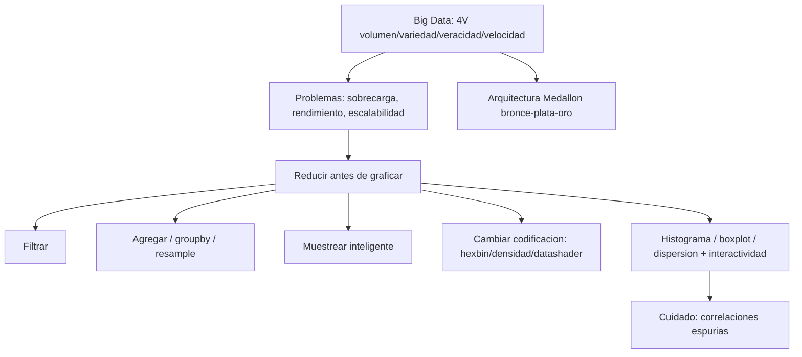

# Visualización de Big Data

**TLDR:** Con datos masivos el problema es la sobrecarga visual y el rendimiento, no la falta de datos. La estrategia es reducir antes de graficar (filtrar, agregar, muestrear) y cambiar la codificación visual (densidad en vez de puntos), apoyándose en interactividad y en herramientas escalables.

## Qué es Big Data: las 4 V

Activos de información de gran volumen, alta velocidad y gran variedad que exigen formas innovadoras de procesamiento para mejor comprensión, decisiones y automatización. Las **4 V**:

- **Volumen:** escala de terabytes a zettabytes; la información generada crece cada día (costo energético de los data centers).
- **Variedad:** video, redes sociales, wearables, texto, imágenes — datos estructurados y no estructurados.
- **Veracidad:** información falsa deliberada (fake news) y sesgos en los datos de entrenamiento.
- **Velocidad:** flujo continuo por canales físicos e inalámbricos.

Evolución del almacenamiento: BD transaccionales/relacionales → **data warehouses** → **data lakes** (repositorio no estructurado, sin integridad referencial) → **data mesh** → **bases de datos vectoriales / embeddings** (todo a vectores numéricos, permiten consultas por prompt; eficientes pero caros → ambientes híbridos). Recordatorio: **70-80% del trabajo** de un proyecto analítico es de datos (disponibilidad, limpieza, homologación).

## Problemas al visualizar datos masivos

Sobrecarga visual (scatter con millones de puntos = "manchones"), problemas de rendimiento (Excel se satura ~1M de registros; también Tableau/Power BI), dificultad para identificar insights relevantes, problemas de escalabilidad (barras con cientos de categorías) y errores de interpretación.

## Principios básicos: reducir antes de graficar

- **Filtrado:** seleccionar solo datos relevantes.
- **Agrupación / agregación:** consolidar puntos individuales en categorías o grupos mayores.
- **Simplificación:** reducir detalle para destacar patrones y tendencias clave. "Información por poner es lo mismo que meter ruido."

### Técnicas de resumen
Agregaciones, **promedios/medias** (sensibles a outliers) y **medianas** (robustas a atípicos). La agregación reduce volumen, mejora rendimiento y revela patrones; sus desventajas: pérdida de detalle, posible sesgo, complejidad, poca flexibilidad y costo computacional. En Pandas: `groupby` y `resample('W'/'M')` para agregación temporal.

### Soluciones por caso
- Demasiadas series → limitar a las relevantes u ofrecer filtros interactivos.
- Muchas categorías → agrupar el resto en "Otros".
- Scatter saturado (**overplotting**) → cambiar la codificación: **heatmap 2D / hexbin**, densidad en vez de puntos, transparencia, o **datashader / WebGL** para millones de puntos.
- Mapas saturados → clustering o zoom interactivo.
- **Submuestreo inteligente:** si la historia no cambia con el 10% de los datos, graficar el 10%.

## Gráficos aptos para grandes volúmenes

Histogramas, boxplots (diagramas de caja) y diagramas de dispersión (con líneas de tendencia, agregación previa e interactividad). Para series temporales: agregación temporal, submuestreo y visualización escalable.

## Arquitectura de datos: Medallón (bronce/plata/oro)

- **Bronce:** dato crudo tal como llega (duplicados, nulos).
- **Plata:** limpieza (quitar duplicados, homologar).
- **Oro (golden record):** reglas de negocio aplicadas, desnormalizado, listo para Power BI/visualización.

Ventaja: trazabilidad del error (¿viene de la fuente o de una regla?).

## Interactividad

**Hover** (detalle al pasar el cursor), **zoom**, **drill down** (bajar al nivel inferior de los datos) y **filtros/selección**. Advertencia: si el mensaje debe ser único y cerrado, mejor un gráfico estático; la interactividad puede "perder" al usuario y dejar que saque conclusiones propias.

## Correlaciones espurias

"Parecen tener sentido pero no lo tienen" (venta de helados vs. eventos de running). Regla: **revisar siempre todas las correlaciones para descartar espurias**. Patrón no es conclusión. Ver [[etica-e-ia-en-visualizacion]] (la IA tiende a afirmar causalidad donde solo hay correlación).

## Ecosistema de herramientas

**Apache Hadoop** (almacenamiento y procesamiento distribuido), **Apache Spark** (motor de análisis a gran escala, batch y tiempo real), **MongoDB** (NoSQL para datos no estructurados), **Elasticsearch** (búsqueda y análisis distribuido); plataformas cloud como AWS Bedrock y Microsoft Fabric. Criterios de selección: cantidad/tamaño de datos (= costo), curva de aprendizaje del equipo, escalabilidad, soporte y reputación.

## Contradicciones a señalar

El profesor dice "las 4 B" por error de dicción (son las 4 V) y menciona un disquete de "1024 KB" (los floppy de 3.5" eran 1.44 MB). Los videos de Big Data en la transcripción MIACD 4 están mal auto-traducidos; sus cifras (Google 20,000 TB/día, Walmart 2,500 TB/hora) no fueron verificadas en clase.

## Preguntas de examen

1. Enumera y explica las 4 V del Big Data.
2. ¿Qué es el overplotting y qué tres estrategias lo resuelven?
3. Diferencia media y mediana como técnicas de resumen: ¿cuándo prefieres cada una y por qué?
4. Describe la arquitectura Medallón y qué contiene cada capa.
5. ¿Qué es una correlación espuria? Da un ejemplo y explica la regla asociada.
6. ¿Cuándo conviene un gráfico interactivo y cuándo uno estático?

## Fuentes

- `raw/articles/Modulo 2 Visualizacion de Datos v2.pdf` (definición, 4 V, problemas, filtrado/agrupación/simplificación, agregación groupby/resample, overplotting, series temporales, correlaciones espurias, Hadoop/Spark/MongoDB/Elasticsearch).
- `raw/notes/MIACD 4 visualización de datos.txt` (4 V, data lakes/vectoriales, Medallón bronce-plata-oro, hexbin, drill down/hover, espurias, criterios de selección de herramientas).

Relacionadas: [[tipos-de-graficos]] · [[herramientas-de-visualizacion]] · [[etica-e-ia-en-visualizacion]] · [[visualizacion-de-datos-fundamentos]] · [[maestria-miacd]]
