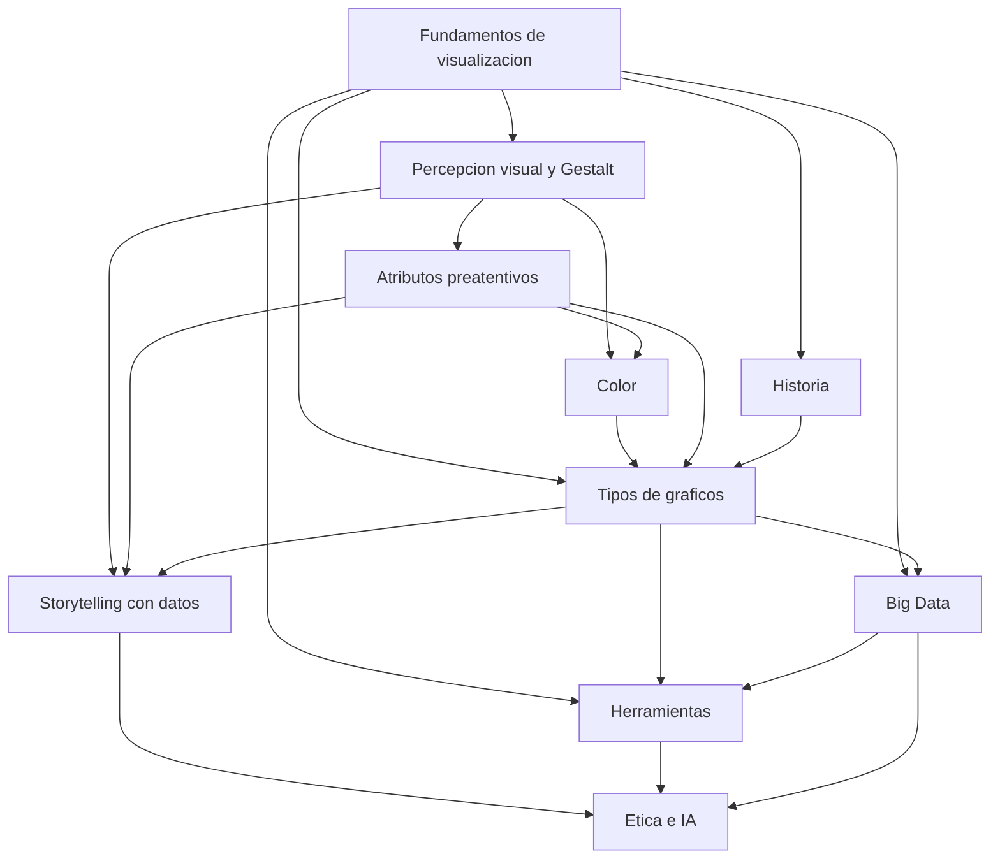

# Visualización de datos: fundamentos (nota hub)

**TLDR:** Nota índice del módulo de Visualización de Datos y Narración de Historias de la MIACD (Mtro. Vladimir Salgado Ramírez). Reúne el qué/para qué de la visualización y conecta las notas de concepto derivadas de las 6 clases + los PDFs de módulo + el paper de historia de Friendly.

## Qué es la visualización de datos

Proceso de representar gráficamente datos e información con el objetivo de hacerlos **comprensibles y accesibles**. Aprovecha la capacidad humana de procesar información visual muy rápido para condensar grandes volúmenes de datos en bruto en algo interpretable.

Permite: **comprender** datos, **identificar** patrones, **detectar** tendencias, **extraer** insights, comparar, ver anomalías. Un **insight** es un hallazgo valioso —un patrón o dato escondido que no se ve a simple vista— ("hay oro molido en los datos").

## Para qué sirve

- **Análisis de datos y EDA** (exploración).
- **Inteligencia de Negocios (BI)** y dashboards para dirección (KPIs).
- **Apoyo a la IA:** comprender los resultados de los modelos.
- **Comunicar conclusiones** de manera efectiva (storytelling).

Impacto declarado: toma de decisiones basada en datos, simplificación de la complejidad, mejor comunicación interdisciplinaria, transparencia y confianza, detección de patrones y anomalías, y potenciación del storytelling con datos.

## Estructura del módulo (curso)

Impartido por **Vladimir Salgado Ramírez** (MIA003). Cuatro módulos: (1) fundamentos de visualización, (2) técnicas para grandes volúmenes de datos, (3) narrativa/storytelling, (4) comunicación efectiva y presentación. Evaluación: 3 tareas (20% c/u) + proyecto final con video (40%).

## Mapa de conceptos

Las notas derivadas de este módulo:

- [[historia-de-la-visualizacion-de-datos]] — de Van Langren y Playfair a Tukey y la era digital; épocas de Friendly.
- [[percepcion-visual-y-gestalt]] — cómo el cerebro interpreta lo visual; leyes de Gestalt; memoria.
- [[atributos-preatentivos-y-jerarquia-visual]] — señales que se procesan antes de razonar; el 10% que importa.
- [[color-en-visualizacion]] — matiz/saturación/luminosidad, color clave, paletas, rampas, accesibilidad.
- [[tipos-de-graficos]] — catálogo y criterio de elección según la relación de datos.
- [[herramientas-de-visualizacion]] — Python (matplotlib/seaborn/plotly/altair/folium) y BI (Tableau/Power BI/Looker); IA copiloto.
- [[visualizacion-de-big-data]] — 4 V, reducir antes de graficar, overplotting, Medallón, interactividad.
- [[storytelling-con-datos]] — objetivo+audiencia, gran idea, arco narrativo, storyboard.
- [[etica-e-ia-en-visualizacion]] — persuadir vs. manipular; límites de la IA; Human in the Loop.

## Idea que atraviesa todo

La visualización es un **medio** entre una idea y un público. Como una carrera de 100 metros: los colores excesivos, la cuadrícula, un gráfico ilegible son "piedras" en el camino. La materia consiste en **quitar todo lo que obstaculiza y poner solo lo que ayuda** a que la idea llegue rápido a la mente del espectador. No hay gráficos buenos o malos: hay herramientas que ayudan o impiden llegar. Y el fin último de toda visualización no es informar, es **provocar una acción**.

## Preguntas abiertas (para investigar antes del examen)

- **Gramática de gráficas (grammar of graphics):** el curso la toca solo implícitamente vía **altair**; no se enseñó formalmente la teoría de Wilkinson (*The Grammar of Graphics*) ni la semiología de Bertin. Conviene estudiarlas aparte si el examen las pide.
- **Autores clásicos ausentes en clase:** Tufte, Bertin, Cleveland y Wilkinson no se explican en las transcripciones; solo aparecen (parcialmente) en el paper de Friendly. ¿Entran al examen?
- **Código concreto:** las transcripciones no contienen código; los notebooks del Blackboard (`Visualizacion_Python_Modulo1/2.ipynb`, fuera de este vault) son la fuente para practicar matplotlib/seaborn/plotly. Pendiente digerirlos si se requiere el detalle de sintaxis.
- **Diseño experimental de percepción:** el curso afirma preferencias perceptuales (barras > pastel para comparar) sin citar la evidencia (Cleveland & McGill). Verificar la jerarquía de tareas perceptuales.

## Referencias citadas en el material

- Michael Friendly (2004/2005), *Milestones in the History of Data Visualization: A Case Study in Statistical Historiography* (lectura L1). Cita a su vez a Playfair, Minard, Bertin (*Sémiologie Graphique*, 1967), Tukey (EDA), Tufte (*The Visual Display of Quantitative Information*, 1983), Stigler.
- Autores históricos referidos en clase/PDF: William Playfair, Charles J. Minard, Florence Nightingale, John Snow, Ben Shneiderman (treemap), Matthew Sankey.
- Cole Nussbaumer Knaflic — presentadora de los videos de *Storytelling with Data* usados en clase.
- Kurt Vonnegut — "las formas de las historias" (usado sin nombrarlo).
- Marcos de ética/IA mencionados: ISO 27000/42000, encíclica papal sobre IA.

## Fuentes

- `raw/notes/MIACD 1 visualización de datos.txt` a `MIACD 6 visualización de datos.txt` (6 transcripciones de clase).
- `raw/articles/Modulo 1 Visualizacion de Datos v2.pdf` y `Modulo 2 Visualizacion de Datos v2.pdf`.
- `raw/articles/L1 Milestones_in_the_History_of_Data_Visualization.pdf`.

Relacionadas: [[maestria-miacd]] · y todas las notas de concepto listadas en el mapa de arriba.
